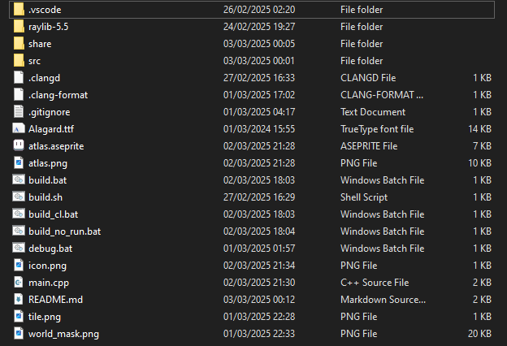

## Theme
Game made in a week with the theme of building a collection.
Player collects familiars to help them defeat a swarm of enemies.
Just for fun, running with the flag `--no-fps-cap` removes frame cap

## Controls
WASD to move
Space to jump

## Screenshot:


## Building From Source:
Due to developing on different platforms, the raylib library must be downloaded separatley
after downloading the library you should have the following directory structure:

#### Linux:
 - Download appropriate raylib 5.5 library (https://github.com/raysan5/raylib/releases/tag/5.5)
 - For most this is (https://github.com/raysan5/raylib/releases/download/5.5/raylib-5.5_linux_amd64.tar.gz)
 - Untar library to raylib-5.5/ in root project folder
 - Execute build command (requires clang++):
    ```command
    ./build.sh
    ```

#### Windows:
 - Download appropriate raylib 5.5 library (https://github.com/raysan5/raylib/releases/tag/5.5)
 - For most this is (https://github.com/raysan5/raylib/releases/download/5.5/raylib-5.5_win64_msvc16.zip)
 - Unzip library to raylib-5.5/ in root project folder
 - Execute build command (requires clang++) from a developer command prompt:
    ```command
    .\build.bat
    ```
 - Can optionally compile with CL compiler
    ```command
    .\build_cl.bat
    ```

